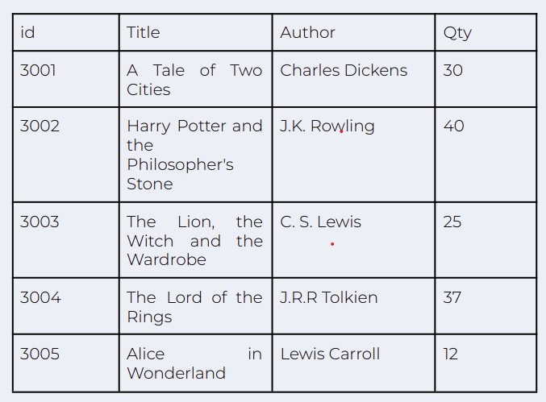

### ASSIGNMENT:

Create a databse called ebookstore to be used by a bookstore clerk. Populate the table with the following:

The program should allow the clerk to:

- add new books to the database
- update book information
- delete books from the database
- search the database to find a specific book
