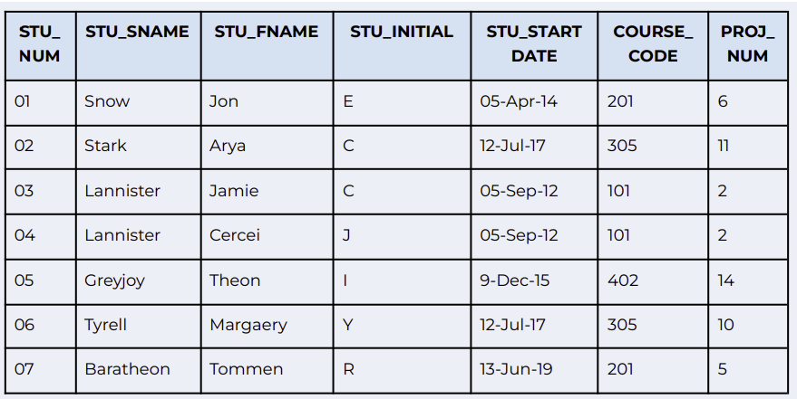
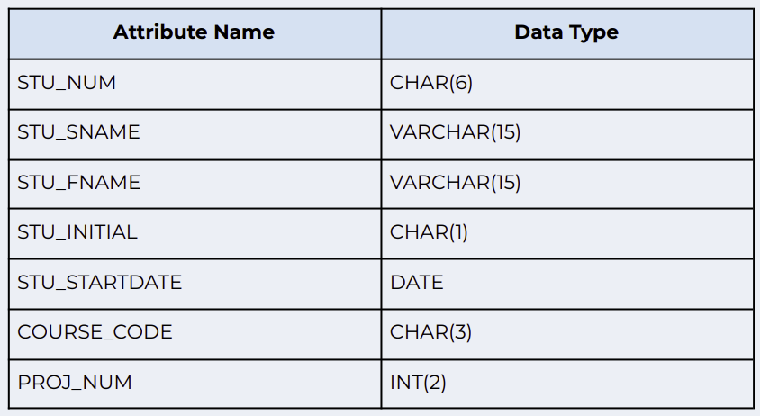

### ASSIGNMENT:

Create a table called Students with SQLite to represent the table in the following figure: 

The table columns should have the following data types:

Perform the following operations on the table:
- List all attributes for a COURSE_CODE of 305
- Change the course code to 304 for the person whose student number is 07
- Delete the row of the person named Jamie Lannister, who started on 5 September 2012, whose course code is 101 and project number is 2; use logical operators
- Change the PROJ_NUM to 14 for all those students who started before 1 January 2016 and whose course code is at least 201
- Delete all of the data inside a table, but not the table itself
- Delete the Students table entirely
